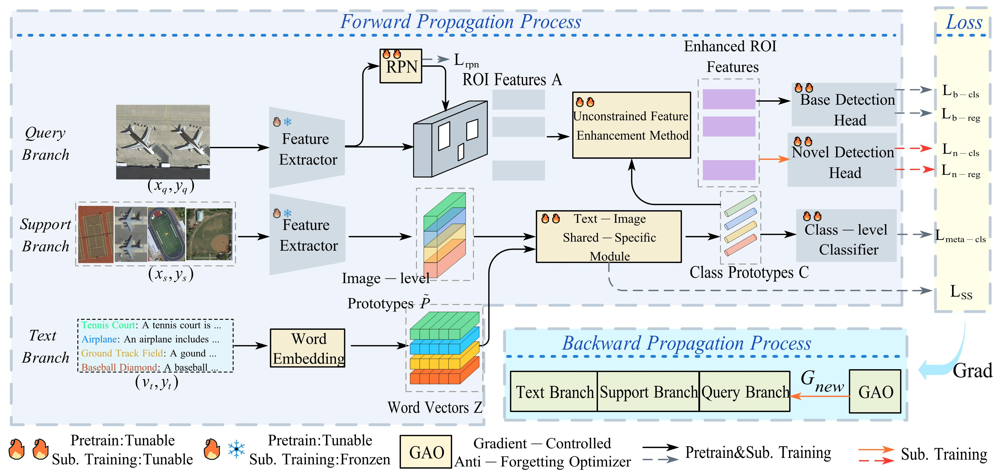
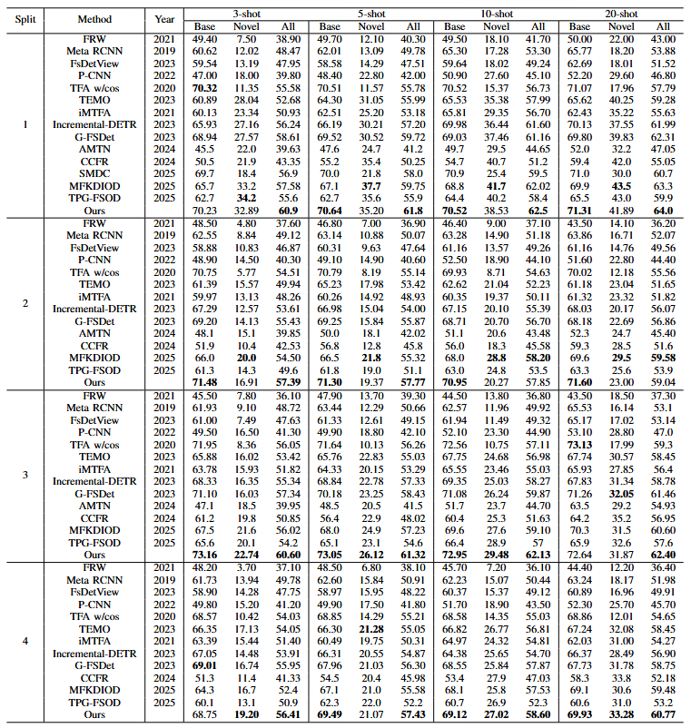
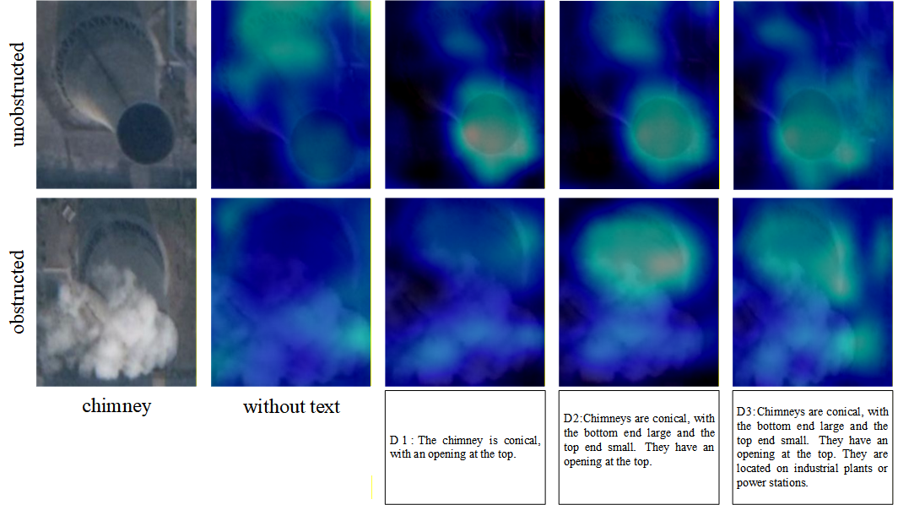

  <div align="center">
    <b><font size="6">UFEDet: Unconstrained Feature Enhancement Text-Guided Few-Shot Remote Sensing Image Object Detector</font></b>
  </div>
<div align="center">

[](https://pypi.org/project/mmfewshot/)
[](https://pypi.org/project/mmfewshot)
[](https://mmfewshot.readthedocs.io/en/latest/)
[](https://github.com/open-mmlab/mmfewshot/blob/master/LICENSE)

</div>

<div align="center">
  English 
</div>

## 📖 Overview

Few-shot object detection (FSOD) in remote sensing images (RSIs) is a significant and challenging task due to the limited number of training samples. The primary bottleneck in current methodologies lies in imprecise classification, which stems from the inability to capture unique visual features of novel classes and the catastrophic forgetting of base classes.

UFEDet addresses these issues through three key perspectives: the features to be classified (RoI features), reference features (feature prototypes), and the classifiers themselves.

<div align="center">
  
</div>

## Core Contributions

### Text-Image Shared-Specific Module (SSM)
Enhances the distinctiveness of class feature prototypes by emphasizing both consistent representations across modalities and unique information within each modality.

### Unconstrained Feature Enhancement Module (UFEM)
Leverages global class information from prototypes to enhance RoI features while increasing the distributional differences between classifiers.

### Gradient-Controlled Anti-Forgetting Optimizer (GAO)
Modulates gradients based on the response of base classes to alleviate catastrophic forgetting during novel class training.

## 🏗️ Framework Architecture

The UFEDet architecture consists of three main branches: **Query Branch**, **Support Branch**, and **Text Branch**.

### Forward Propagation
Processes query images, support images, and text descriptions to generate generalizable feature prototypes $C$ and enhanced RoI features.

### Loss Calculation
Includes standard detection losses ($L_{rpn}, L_{cls}, L_{reg}$) alongside a specialized shared-specific loss $L_{SS}$.

### Backward Propagation
Introduces the GAO to adjust the overall gradient $G_{new}$ to mitigate the impact of catastrophic forgetting.

## 🛠️ Key Components

### 1. Text-Image Shared-Specific Module (SSM)

This module partitions features into consistent and distinctive characteristics. It uses a relationship matrix to ensure common components are highly consistent (similarity near 1) and unique components remain distinct (similarity near 0).

### 2. Unconstrained Feature Enhancement Module (UFEM)

Unlike sample-guided strategies, UFEM proposes a classifier-guided enhancement strategy. It reduces the impact of sample imbalance on classifier distributions and maintains the diversity of classifier parameters, enhancing robustness in complex scenarios.

### 3. Gradient-Controlled Anti-Forgetting Optimizer (GAO)

GAO acts as an observer during the subsequent training stage. It calculates a statistical gradient value $\tilde{G}_{b}$ for base classes. If this value is large, the GAO reduces the current network gradients to preserve base class performance.


## 📊 Experimental Results

### Performance on DIOR Dataset
<div align="center">
  
</div>

### Computational Cost

Analysis conducted on a single NVIDIA 4090 GPU with $1333 \times 800 \times 3$ resolution:

| Metric | Meta R-CNN | UFEDet (Ours) |
|--------|------------|---------------|
| Inference Time | 0.056s | 0.063s |
| Parameters | 60.73M | 69.23M |
| GFLOPs | 1390.0 | 1460.0 |


<div align="center">
  
</div>

<div align="center">
  
</div>
## 📜 Citation

If you find this work helpful for your research, please cite our paper:

```bibtex
@article{shang2026unconstrained,
  title={Unconstrained Feature Enhancement Text-Guided Few-Shot Remote Sensing Image Object Detector},
  author={Shang, Xiping and Zhao, Wei and Chen, Haoxiang and Fan, Xudong and Li, Nannan and Li, Dongjin and Lv, Jianwei and Zhang, Rufei},
  journal={IEEE Transactions on Geoscience and Remote Sensing},
  volume={64},
  pages={1--16},
  year={2026},
  publisher={IEEE},
  doi={10.1109/TGRS.2025.3645347}
}
```

## 🚀 Installation

Please refer to the [installation guide](docs/en/install.md) for detailed instructions on setting up the environment.

## 📚 Usage

### Training

```bash
# Train on the DIOR dataset
python tools/detection/train.py configs/detection/final_exp/dior/split1/cls-meta-rcnn_r101_c4_8xb4_base-training_dior_split1.py

python tools/detection/train.py configs/detection/final_exp/dior/split1/cls-meta-rcnn_r101_c4_8xb4_20shot-fine-tuning_dior_split1.py
```

### Testing

```bash
# Test on the DIOR dataset
python tools/detection/test.py configs/detection/final_exp/dior/split1/cls-meta-rcnn_r101_c4_8xb4_20shot-fine-tuning_dior_split1.py checkpoints/latest.pth --eval bbox
```

## 📄 License

This project is released under the [Apache 2.0 license](LICENSE).

## Keywords

Feature extraction; Object detection; Prototypes; Training; Remote sensing; Detectors; Proposals; Interference; Training data; Metalearning; Few-shot learning; object detection; remote sensing images (RSIs); text-modal knowledge

## Acknowledgments

This project is built upon the [OpenMMLab FewShot Learning Toolbox](https://github.com/open-mmlab/mmfewshot). We appreciate all the contributors to this ecosystem.